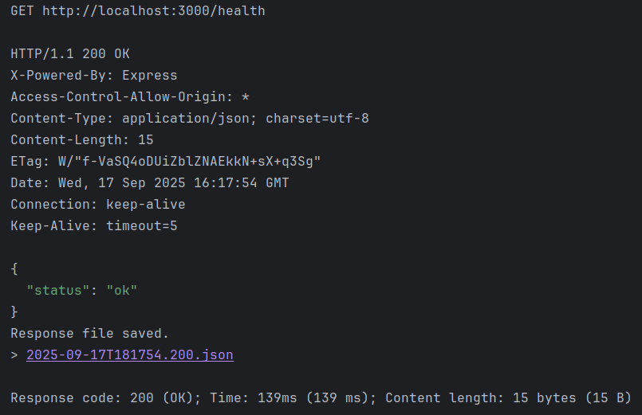
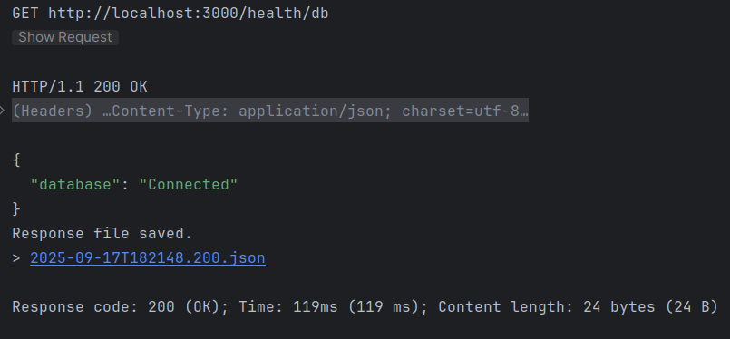
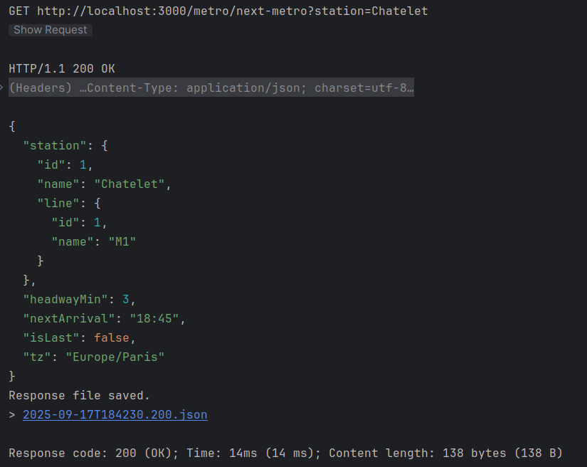
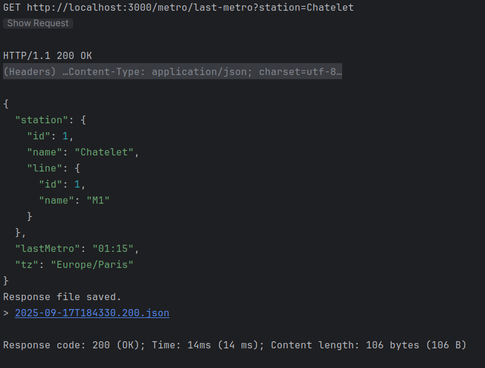
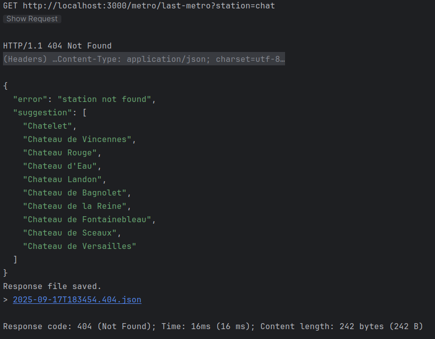
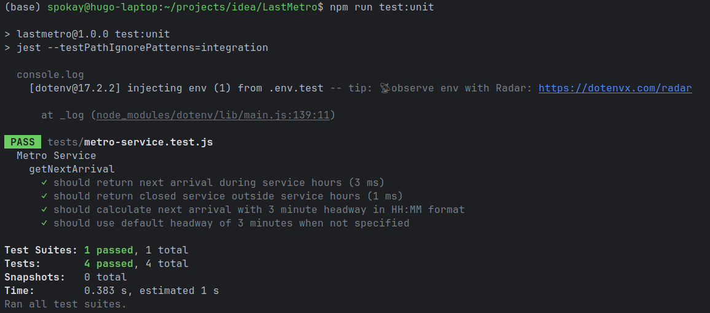
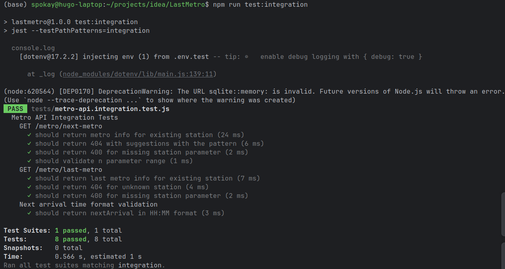

# Livrable du 17 / 09 / 2025

## Requetes API
Les requêtes pour tester les endpoints de l'API sont répertoriés dans le fichier `requests-livrable.http`.

Le swagger est intégré à l'API (pas dans le compose) et accessible a l'endpoint `/api-docs`.

## Screenshots
Si besoins, j'ai ajouté des captures d'écran dans le dossier `screenshots` pour illustrer les résultats des tests et des requêtes.

### Health endpoint

### Health db endpoint

### Next metro endpoint

### Last metro endpoint

### Last metro endpoint - station inconnue

## Tests unitaires

## Tests d'intégration
